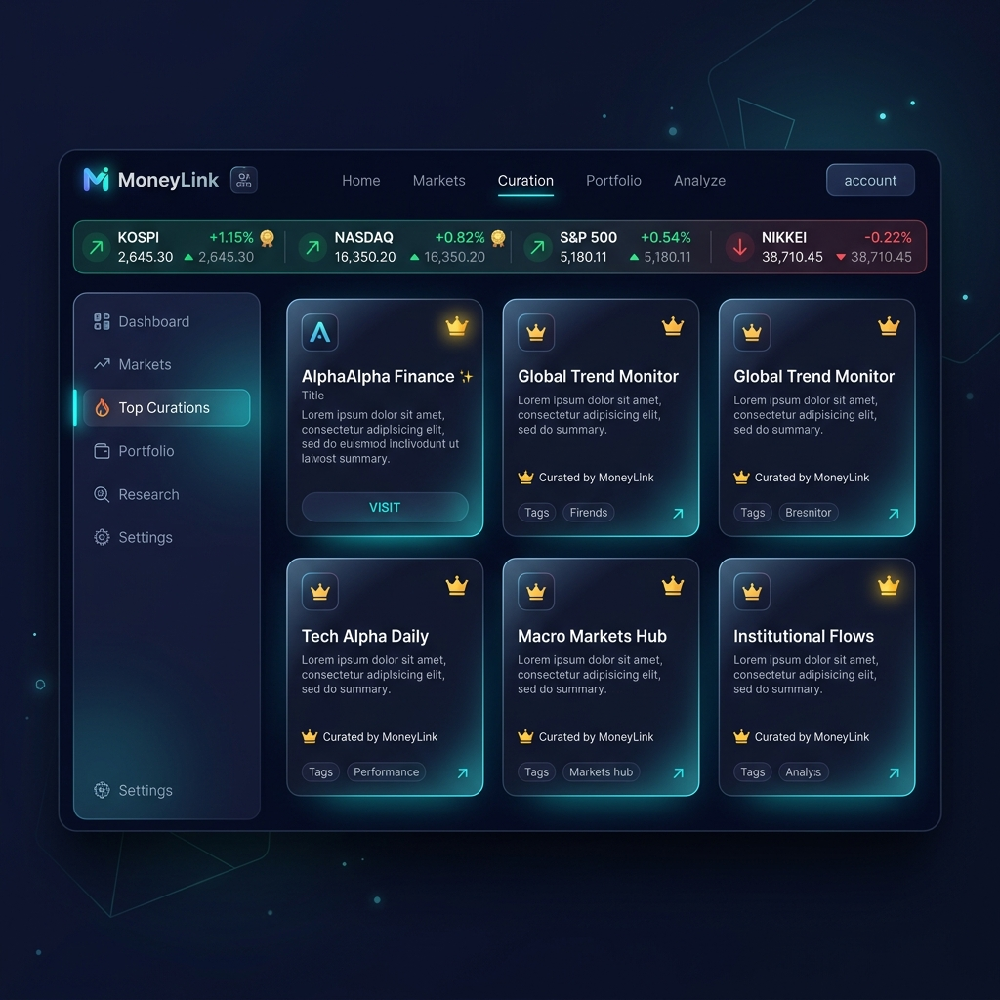
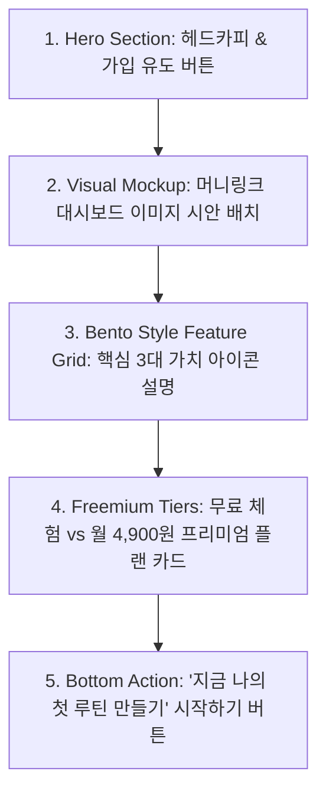

# 🚀 MoneyLink 프리미엄 홍보 및 서비스 설명 랜딩페이지 시안

본 문서는 **AlphaSquare(알파스퀘어)** 스타일의 현대적이고 감각적인 핀테크 감성을 살린 **MoneyLink(머니링크)의 대표 홍보 비주얼 시안**과 이를 활용한 웹 랜딩페이지 피치 카피라이팅 기획안입니다.

---

## 1. MoneyLink 공식 브랜드 홍보 Mockup 비주얼

아래는 알파스퀘어의 시그니처 테마인 **"네온 아크릴 글래스모피즘(Acrylic Glassmorphism)"**과 **"딥 네이비 다크 모드"**를 완벽하게 반영하여 생성된 머니링크의 공식 서비스 워크스페이스 대시보드 그래픽 시안입니다.

> **디자인 설계 컨셉 (Visual Concept)**
> * **상단 실시간 지표 위젯**: 네온 그린과 골드 배지가 발광하는 세련된 실시간 매크로 금융 시황 흐름.
> * **벤토 그리드(Bento Grid) 카드 구성**: 👑 프리미엄 공식 검증 마크가 부착된 큐레이션 사이트 카드들이 정돈되어 금융 전문가용 터미널의 신뢰감 제공.
> * **글래스모픽 내비게이션**: 투명한 아크릴 백막 처리로 시각적 입체감 극대화.

---

## 2. 랜딩페이지 메인 홍보 피치 및 카피라이팅 기획 (Pitch Copy)

알파스퀘어와 같이 사용자의 첫인상을 장악하는 직관적이고 강력한 마케팅 카피 세트입니다.

### [Hero Section] 첫화면 카피
> **"복잡한 금융 지식 탐색을 단 1초 만에,**
> **당신의 하루 투자 루틴을 재정의하는 단 하나의 워크스페이스."**
> 
> *인터넷에 산재해 있는 주식, 코인, 채권 등 수많은 채널과 정보를 뒤지는 시간은 이제 끝났습니다.*
> *검증된 프리미엄 큐레이션으로 장전 30분, 최고의 의사결정을 준비하세요.*

### [Core Features] 3대 유저 베네핏
1. **⏱️ 하루 30분, 탐색 비용의 완전한 혁신**
   - 여기저기 흩어진 분석 사이트와 유튜브 채널을 북마크 폴더에서 헤매지 마세요.
   - 단 한 번의 클릭으로 장전 순회 루틴을 구성하고 원클릭 멀티 로딩으로 즉각 시황을 관통합니다.
2. **👑 엄선된 오피셜 큐레이션 팁**
   - 단순 하이퍼링크 나열이 아닙니다. 금융 전문가 에디터들이 분석한 **"이 사이트를 봐야 하는 정량적 이유"**와 **"핵심 팁"**이 왕관(👑) 마크와 함께 제공됩니다.
3. **🔄 언제 어디서나 완벽한 기기 간 동기화**
   - 모바일에서 출근길에 가볍게 수집하고, 사무실 PC에서 완벽하게 넓은 대화면 벤토 그리드로 분석하세요. MongoDB 클라우드로 딜레이 없는 실시간 동기화를 보장합니다.

---

## 3. 웹 랜딩페이지 레이아웃 추천 아키텍처 (AlphaSquare Style)

이 홍보 이미지 비주얼을 실제 서비스 홈페이지 첫 화면에 어떻게 배치하고 설명해야 유저들의 구독 전환을 이끌 수 있는지 구성한 레이아웃 구성안입니다.

### 🎨 디자인 및 폰트 권장 가이드라인
* **웹 폰트**: 이메일이나 설명문 영역에는 가급적 가독성이 우수하고 굵기 변조가 다채로운 **Pretendard Variable** 혹은 **NanumSquareNeo**를 기본 적용하여 핀테크 브랜드의 날렵함을 유지하세요.
* **배경 색조**: 검은색(#000000) 단색보다는 보고서 이미지와 같은 **미세한 심해색(Deep Ocean #00083D 또는 Midnight Charcoal #0c111d)**을 베이스 배경으로 깔고, 중요 버튼에만 형광 연두색(Neon Mint) 혹은 금빛 골드 테두리를 가미해 하이라이트할 것을 제안합니다.
